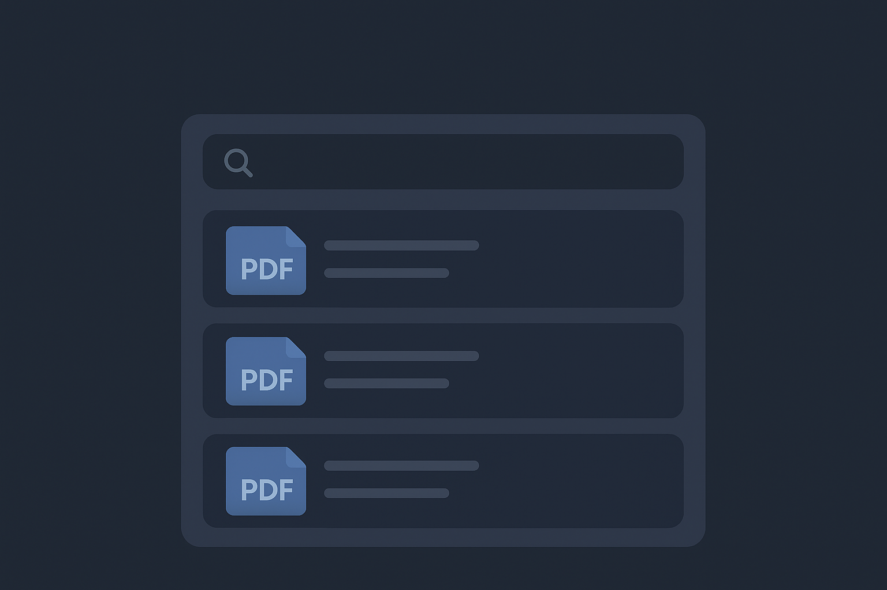

# ManualMate

<p align="center">
  
</p>

<p align="center">
  <strong>RAG-Powered Product Manual Q&A System</strong><br>
  A .NET Web API project designed for processing product PDF manuals, generating embeddings, and providing a Q&A service using Retrieval Augmented Generation (RAG), with integrated caching and scheduled jobs.
</p>

---

## Table of Contents

- [Features](#features)
- [Project Structure](#project-structure)
- [Requirements](#requirements)
- [Setup](#setup)
- [Usage](#usage)
- [Key Components](#key-components)

---

## Features

- **Retrieval Augmented Generation (RAG):** Implements a Q&A system for manuals by retrieving relevant information and augmenting an LLM's response.
- **Text Chunking and Embedding:** Processes manual content into chunks and generates embeddings using Hugging Face models.
- **Caching with Redis:** Utilizes Redis for efficient data caching, improving performance for frequently accessed data.
- **Job Scheduling:** Background jobs for tasks like embedding generation and product data caching.
- **PDF Extraction:** Extracts text content from PDF manuals.
- **RESTful API:** Provides a clean API for interacting with the manual processing and Q&A services.

---

## Project Structure
```
ManualMate/
├── Controllers/
│   └── ProductsController.cs
├── Interfaces
├── CacheJobs/
│   ├── EmbeddingCacheJob.cs
│   └── ProductCacheJob.cs
├── Migrations/
├── Models/
│   ├── Product.cs
│   └── ManualEmbedding.cs
├── Persistence/
├── Services/
│   ├── FileUploadService.cs
│   ├── GeminiLlmService.cs
│   ├── HuggingFaceEmbeddingService.cs
│   ├── ManualProcessingService.cs
│   ├── ManualQaService.cs
│   ├── PdfExtractor.cs
│   ├── ProductService.cs
│   ├── RedisService.cs
│   └── TextChunker.cs
└── Program.cs
```

---

## Requirements

### System Requirements
- **.NET 8.0 SDK** or later
- **SQL Server**
- **Redis**

### API Keys
- **Hugging Face API Token** - For Embeddings service
- **Google Gemini API Key** - For LLM service

---

## Setup

### 1. Clone Repository
```bash
git clone https://github.com/yourusername/manualmate.git
cd manualmate
```

### 2. Install Dependencies
```bash
dotnet restore
```

### 3. Install and Start Redis

**Windows:**
```bash
# Using Chocolatey
choco install redis-64

# Start Redis
redis-server
```

### 4. Database Setup

Update `appsettings.json` with your connection string:
```json
{
  "ConnectionStrings": {
    "DefaultConnection": "Server=.;Database=ManualMateDB;Trusted_Connection=True;TrustServerCertificate=True",
    "Redis": "localhost:6379"
  }
}
```

Run migrations:
```bash
dotnet ef migrations add InitialCreate
dotnet ef database update
```

### 5. Configure API Keys

Add to `appsettings.json`:
```json
{
  "HuggingFace": {
    "ApiToken": "hf_your_token_here"
  },
  "Gemini": {
    "ApiKey": "your_gemini_api_key_here"
  }
}
```

### 6. Run Application
```bash
dotnet run
```

---

## Usage

### Upload Product Manual

`POST /api/product/upload-manual/{id}`

---
### Process Product Manual

`POST /api/product/process-manual/{id}`

---

### Ask Questions

`POST api/product/ask/1?question=`

**Response:**
```json
{
  "question": "How do I clean the filter?",
  "answer": "According to the manual, clean the filter weekly by removing it and rinsing under warm water."
}
```


## Key Components

### 1. RAG Service (`ManualQaService.cs`)
- Orchestrates the RAG pipeline
- Converts questions to embeddings
- Performs similarity search
- Generates answers using LLM (`gemini-2.5-flash-lite`)

### 2. Caching Service (`RedisService.cs`)
- Implements Redis-based caching
- Stores frequently accessed data

### 3. Background Jobs (`Quartz.NET`)

**EmbeddingCacheJob:**
- Runs periodically to cache embeddings
- Pre-computes frequently used vectors

**ProductCacheJob:**
- Caches product data
- Reduces database queries

### 4. Embedding Service (`HuggingFaceEmbeddingService.cs`)
- Converts text to semantic vectors
- Uses Hugging Face models (`bge-small-en-v1.5`)
- Calculates cosine similarity

### 5. LLM Service (`GeminiLlmService.cs`)
- Generates natural language answers
- Uses Google Gemini API
- Grounded only in retrieved context

### 6. Manual Processing (`ManualProcessingService.cs`)
- Extracts text from PDFs
- Chunks text into manageable pieces
- Generates and stores embeddings

---
