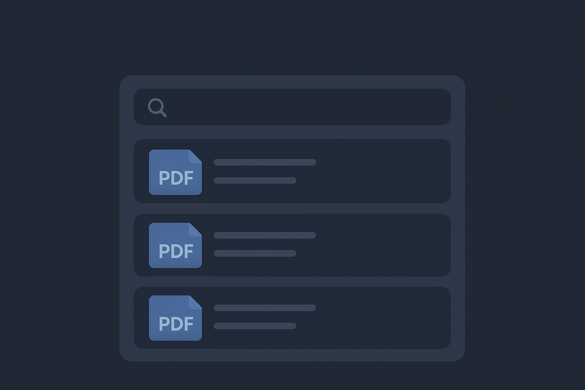

# ManualMate

<p align="center">
  
</p>

<p align="center">
  <strong>RAG-Powered PDF Manuals Q&A System</strong><br>
  A .NET Full Stack Web Application designed for processing PDF user manuals, generating embeddings, and providing a Q&A service using Retrieval Augmented Generation (RAG), with integrated caching.
</p>

---

## Table of Contents

* [Features](#features)
* [Usage](#usage)
* [Performance](#performance)
* [Key Components](#key-components)
* [Requirements](#requirements)
* [Setup](#setup)

---

## Features

* **Retrieval Augmented Generation (RAG):** Implements a Q&A system for user manuals by retrieving relevant information and augmenting an LLM's response.
* **Smart Vector Storage (pgvector):** Uses PostgreSQL with `pgvector` to perform lightning-fast similarity searches directly in the database.
* **Text Chunking and Embedding:** Processes manual content into chunks and generates embeddings using Hugging Face models (`bge-small-en-v1.5`).
* **Caching with Redis:** Stores answers to repeated questions for instant retrieval.
* **PDF Extraction:** Extracts text content from PDF manuals.
* **RESTful API:** Clean endpoints for managing manuals and asking questions.

---

## Usage

<p align="center">
  
</p>

### Upload Product Manual

`POST /api/product/upload-manual/{id}`

---

### Process Product Manual

`POST /api/product/process-manual/{id}`

*Extracts text, creates vector embeddings, and stores them in PostgreSQL for fast retrieval.*

---

### Ask Questions
<p align="center">
  
</p>

<p align="center">
  
</p>

`POST /api/product/ask/{id}?question=How do I reset the device?`

**Response:**

```json
{
  "question": "How do I reset the device?",
  "answer": "According to the manual, press and hold the reset button for 5 seconds until the LED blinks."
}
```

---

## Performance

Performance is optimized by moving from a traditional SQL search to **PostgreSQL with pgvector** and adding **Redis caching**.

### 1. Vector Search Speed (PostgreSQL + pgvector)
By using `pgvector`, I switched from slow manual calculations in code to native database indexes.
* **Old Way :** Loaded all data into memory to find matches (Slow & Heavy).
* **New Way (pgvector):** Uses HNSW indexes to find relevant answers in **milliseconds** without loading unnecessary data.

### 2. Caching Impact (Redis)
We cache the final answers to prevent re-processing common questions.

**Example Request:** `GET .../ask/8?question=how to sleep` (PlayStation 5 manual)

* **First Request (Database Search):** ~2782 ms
* **Second Request (Redis Cache):** ~45 ms

Result: **~98% Faster** for repeated questions.

---

## Key Components

### 1. RAG Service (`ManualQaService.cs`)
* Coordinates the question-answering flow.
* Uses vector search to find the best context.

### 2. Database Service (`PostgreSQL + pgvector`)
* Stores document text and their vector embeddings.
* Performs **Cosine Distance** searches natively to find relevant manual chunks.

### 3. Caching Service (`RedisService.cs`)
* Intercepts requests to serve cached answers instantly.

### 4. Embedding Service (`HuggingFaceEmbeddingService.cs`)
* Converts text chunks into 384-dimensional vectors using `bge-small-en-v1.5`.

### 5. LLM Service (`GeminiLlmService.cs`)
* Generates natural language answers using Google Gemini.

---

## Requirements

### System Requirements

* **.NET 8.0 SDK** or later
* **PostgreSQL** (with `pgvector` extension enabled)
* **Redis**

### API Keys

* **Hugging Face API Token** (for Embeddings)
* **Google Gemini API Key** (for Answer Generation)

---

## Setup

### 1. Clone Repository

```bash
git clone
cd manualmate
```

### 2. Install Dependencies

```bash
dotnet restore
```

### 3. Database Setup (PostgreSQL)

Ensure PostgreSQL is installed. Update `appsettings.json` with your credentials:

```json
{
  "ConnectionStrings": {
    "ManualMateDbContext": "",
    "Redis": ""
  }
}
```

Run migrations (this automatically enables the `vector` extension):

```bash
dotnet ef database update
```

### 4. Configure API Keys

Add to `appsettings.json`:

```json
{
  "HuggingFace": {
    "ApiToken": ""
  },
  "Gemini": {
    "ApiKey": ""
  }
}
```

### 5. Run Application

```bash
dotnet run
```
